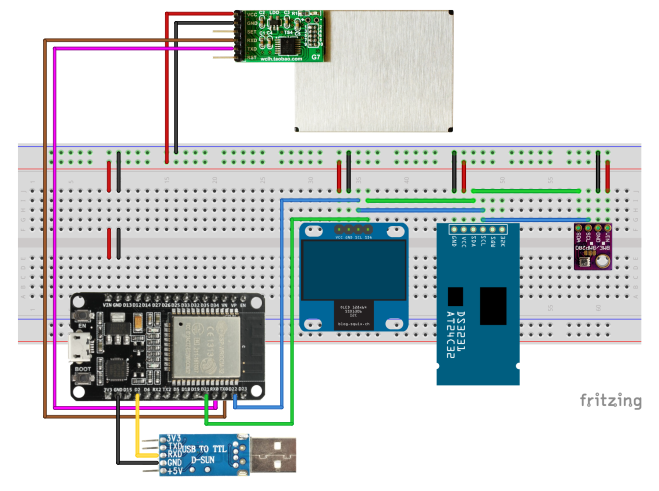

# Home Air Quality Station
Project explains how to build home air quality monitoring station using ESP32. Feel free to use and share any code from this repository.

## Project requirements
### Hardware
Project was developped using DOIT ESP32 DevKit V1 microcontroller with following sensors:
* Plantower PMS7003 Laser Dust Sensor with IDC Adapter
* BME280 Temperature, Humidity and Pressure Sensor
* DS3231 Real Time Clock + CR2032 Battery
* PL2303 USB to Serial
* Jumping Wires
* Breadboard

### Software
To compile sketch please download [Arduino IDE](https://www.arduino.cc/en/Main/Software) and add following libraries either manually or through the library manager:
* [BME280_I2C_ESP32](https://github.com/Takatsuki0204/BME280-I2C-ESP32)
* [PMS Library](https://github.com/fu-hsi/PMS)
* [RTClib](https://github.com/adafruit/RTClib)
* [ESP32 OLED Driver for SSD1306 display](https://github.com/ThingPulse/esp8266-oled-ssd1306) (*optional)

'*' - Instead of OLED display, USB-UART can be used to visualize the data

## Hardware Connection
### Circuit scheme
Please be aware that project relies on DOIT ESP32 DevKit V1 and was not tested with any other ESP32 microcontrollers. Pin definitions may be slightly different, please refer to your microcontroller datasheet and compare it with [DOIT ESP32 DevKit V1](https://raw.githubusercontent.com/playelek/pinout-doit-32devkitv1/master/pinoutDOIT32devkitv1.png).

