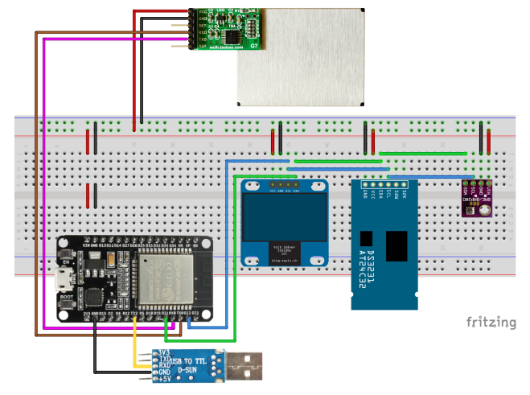

# Home Air Quality Station
Project explains how to build home air quality monitoring station using ESP32. Feel free to use and share any code from this repository.

## Project requirements
### Hardware
Project was developped using DOIT ESP32 DevKit V1 microcontroller with following sensors:
* Plantower PMS7003 Laser Dust Sensor with IDC Adapter
* BME280 Temperature, Humidity and Pressure Sensor
* DS3231 Real Time Clock + CR2032 Battery
* PL2303 USB to Serial
* Jumping Wires
* Breadboard

### Software
To compile sketch please download [Arduino IDE](https://www.arduino.cc/en/Main/Software) and add following libraries either manually or through the *Library Manager*:
* [BME280_I2C_ESP32](https://github.com/Takatsuki0204/BME280-I2C-ESP32)
* [PMS Library](https://github.com/fu-hsi/PMS)
* [RTClib](https://github.com/adafruit/RTClib)
* [ESP32 OLED Driver for SSD1306 display](https://github.com/ThingPulse/esp8266-oled-ssd1306) (*optional)

\* Instead of OLED display, USB-UART can be used to visualize the data

#### Additional settings
In order to use ESP8266/ESP32 boards we have to add additional URL's into *Boards Manager*.
1. Open Arduino IDE, go to *Preferences* and add following ESP cores into *Additional Board Manager URLs* (multiple paths can be added, we just need to separate them by commas).
    * http://arduino.esp8266.com/stable/package_esp8266com_index.json
    * https://dl.espressif.com/dl/package_esp32_index.json
2. Confirm changes, go to main window and select *Tools* > *Board:...* > *Boards Manager...*
3. Install ***esp8266 by ESP8266 Community*** and ***esp32 by Espressif Systems***.
4. When installation has been finished restart Arduino IDE.
5. We are ready to use our boards.

\* Complete installation instructions can be found under following links:
* [ESP8266](https://github.com/esp8266/Arduino)
* [ESP32](https://github.com/espressif/arduino-esp32)

#### CH340 Chip drivers
Many ESP8266 boards use CH340 chip to provide USB connectivity and in some cases users may need to install additional drivers. Select and download drivers from chip manufacturers [website](https://sparks.gogo.co.nz/ch340.html). Following procedures were successfully tested on macOS High Sierra and Windows 7. Ubuntu doesn't require drivers to be installed.

\* Linux Users
* Linux users may need to run following command ```sudo usermod -a -G dialout $USER``` to allow non-root access to /dev/ttyUSB0. Reboot your system to apply changes.
* If you are using python distributions other than default (i.e. anaconda/miniconda) you may need to install pySerial module first for your default distribution.
```sudo /usr/bin/python2 -m pip install pyserial```

## Hardware Connection
### Circuit scheme
Please be aware that project relies on DOIT ESP32 DevKit V1 and was not tested with any other ESP32 microcontroller. Pin definitions may be slightly different, please refer to your microcontroller datasheet and compare it with [DOIT ESP32 DevKit V1](https://raw.githubusercontent.com/playelek/pinout-doit-32devkitv1/master/pinoutDOIT32devkitv1.png).


